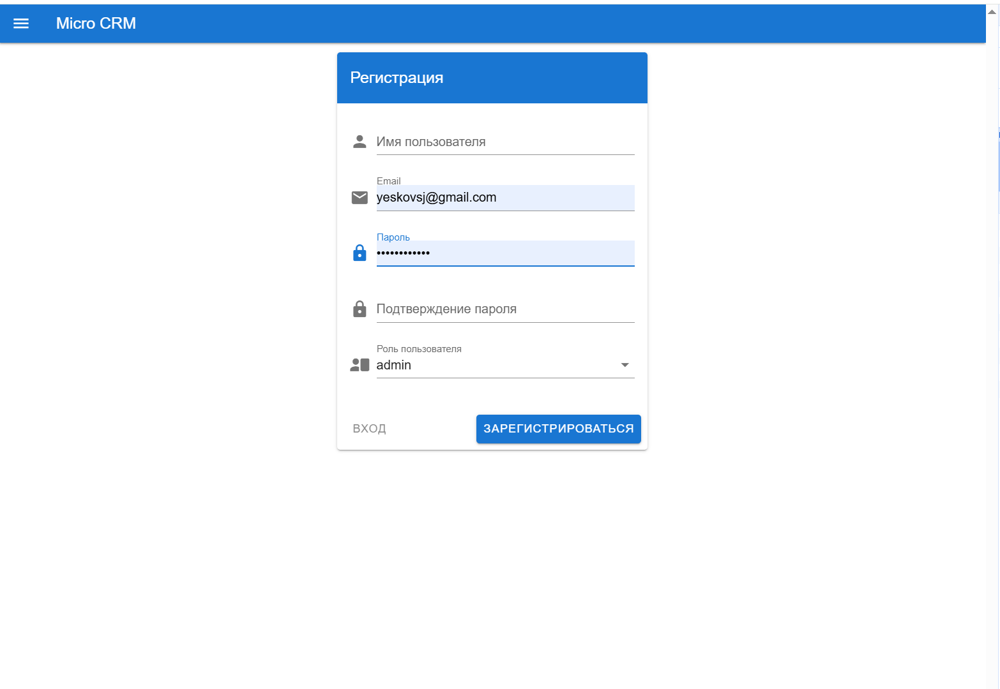
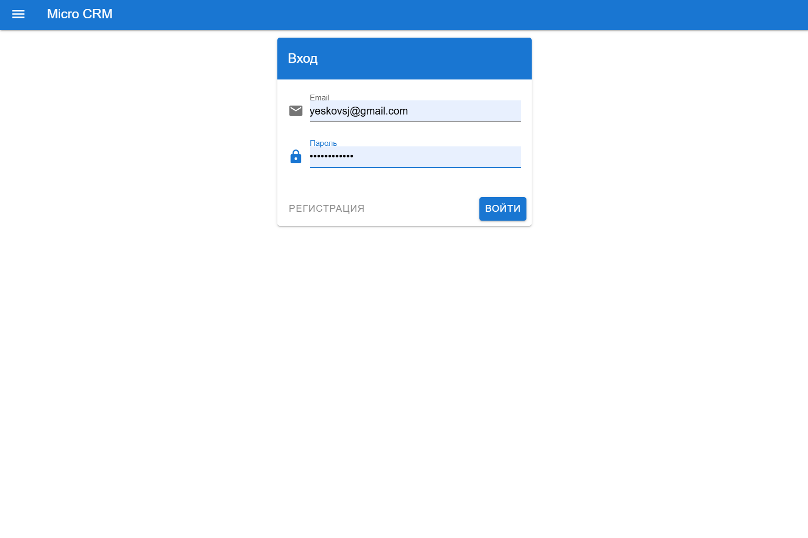
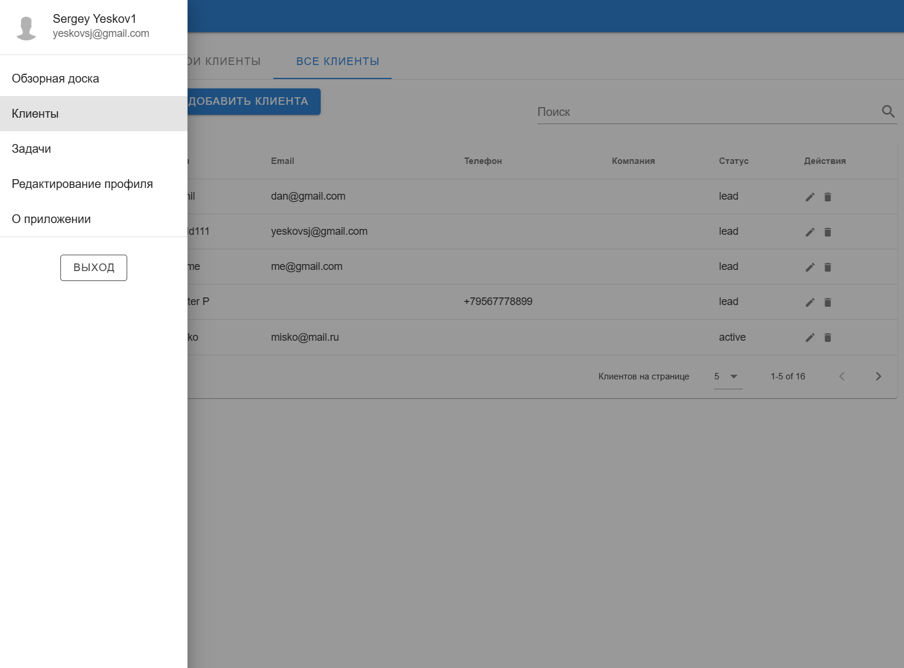
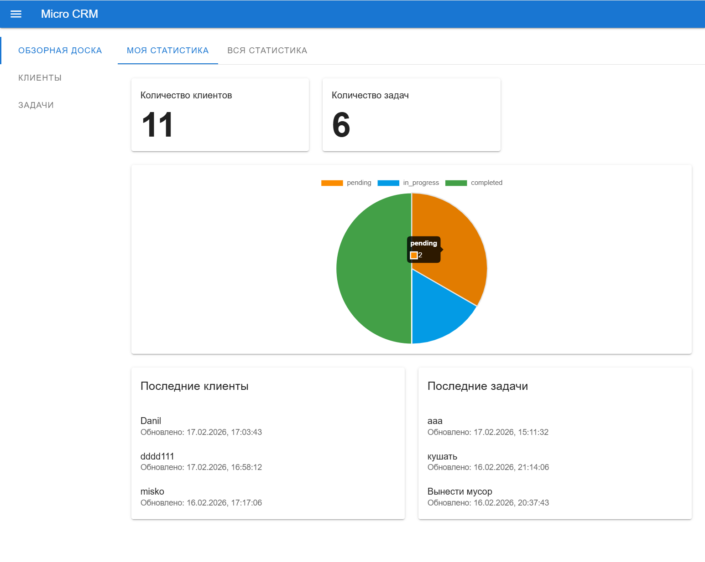
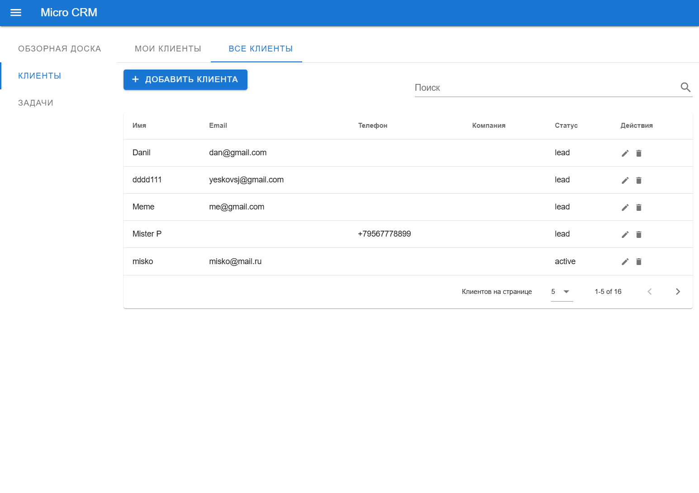
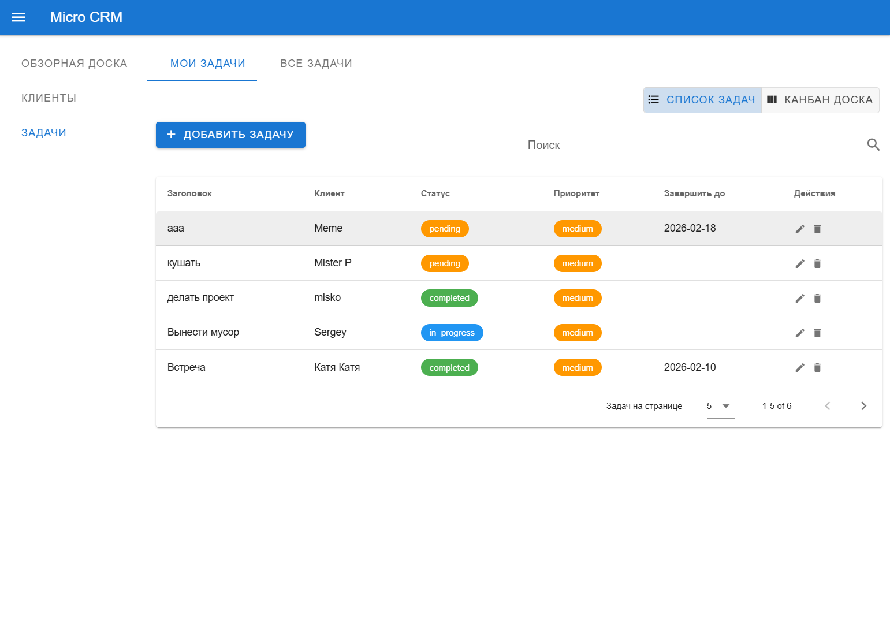
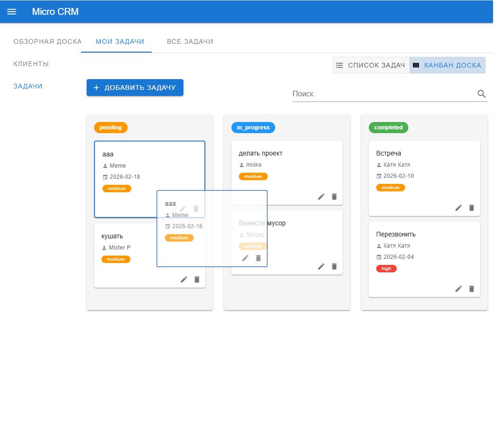
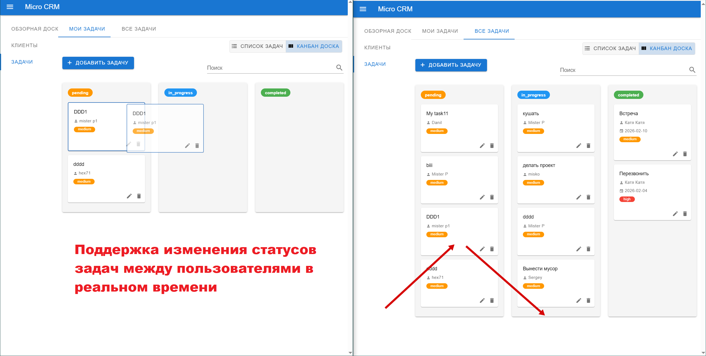

#### Setup

BACKEND:
1. Добавить .env в /backend;
2. FRONTEND_URL="http://localhost:3001"
3. MONGO_URI="mongodb+srv://..."
4. JWT_SECRET="jwt_secret_very_secret"
5. JWT_LIFETIME="1h"

```bash
npm install && npm run build && npm start
```

По умолчанию бекенд запустится на порту 3000.

FRONTEND:
1. Добавить .env в /frontend;
2. VITE_BACKEND_URL="http://localhost:3000/api/v1";
3. VITE_SOCKET_URL="http://localhost:3000"

```bash
npm install && npm run build && npm run preview
```

По умолчанию фронтенд запустится на порту 3001.











